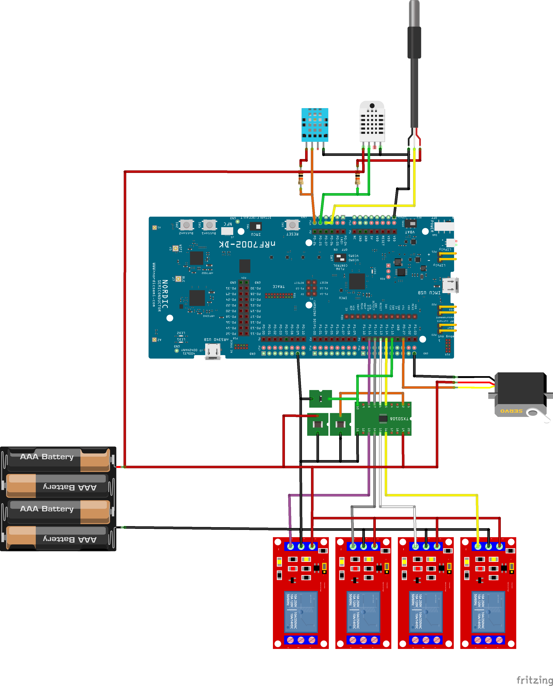

# Fritzing Sketch

This repo contains the Fritzing Sketch and all the Fritzing parts used

### Sketch: WiFi_Device_Sketch.fzz

### PART LIST:

- **5V Relay:** 5V RELAY 2.0.fzpz
- **DHT22 Sensor:** DHT22 Humidity and Temperature Sensor.fzpz
- **DHT11 Sensor:** Humidity and Temperature Sensor DHT11improved.fzpz
- **DS18B20 Sensor:** DS18B20 1-Wire Temperature Sensor Probe-new-modId.fzpz

